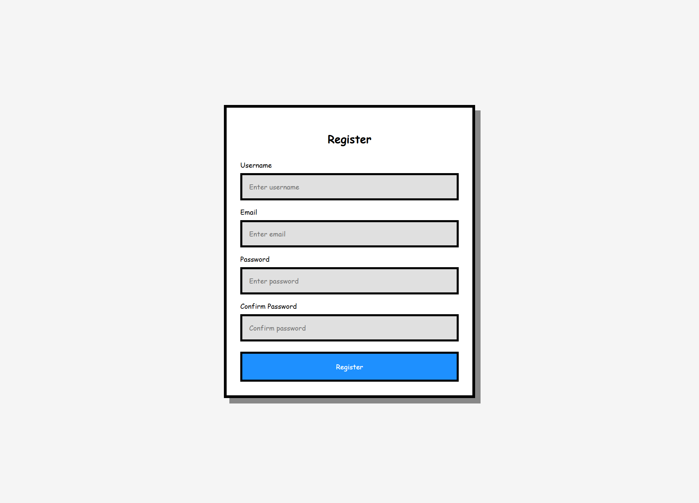

<h1 align="center">✅ VALIDADOR DE FORMULÁRIO RETRÔ ✅</h1>

###



<h4 align="center"><a href="https://joao-enrique.github.io/form-validacao/">Confira o projeto aqui</a></h4>

👾 Bem-vindo ao **Validador de Formulário Retrô** — uma aplicação simples e prática para validar campos de formulário, com um toque nostálgico em **pixel art**. 🚀  

###

<h2 align="left">🕹️ Funcionalidades</h2>

###
- ✅ Validação em tempo real dos campos  
- ✅ Feedback visual para erros e acertos  
- ✅ Campos obrigatórios destacados  
- ✅ Design retrô em pixel art  
- ✅ Totalmente responsivo  

###

<h2 align="left">🧠 Como funciona?</h2>

###
1. O usuário preenche os campos do formulário.  
2. O sistema valida se os dados estão corretos (ex: e-mail válido, campos obrigatórios etc.).  
3. Mensagens de erro aparecem em estilo retrô caso algo esteja errado.  
4. Quando tudo está válido, o formulário pode ser enviado normalmente.  

Tudo isso em uma experiência divertida e nostálgica 🎨  

###

<h1 align="left">💾 Tecnologias utilizadas</h1>

###
<div align="left">
  
  
  
  
  
</div>

###

<h1 align="left">🧪 Como rodar?</h1>

###
<p align="left">1. Faça o clone do projeto:</p>

```bash

https://github.com/joao-enrique/form-validacao.git

```

<p align="left">2. Abra o <code>index.html</code> em seu navegador.</p>
<h1 align="left">👨‍💻 Estrutura</h1>

📁 form-validator-retro<br>
├── index.html # Estrutura do formulário<br>
├── style.css # Visual retrô/pixel art<br>
├── script.js # Lógica de validação<br>
└── README.md # Você está aqui!

<h1 align="left">🔮 Futuras melhorias</h1>

Mensagens de erro animadas em 8-bit 🎮

Mais tipos de validação (CPF, telefone etc.) 📋

Animações sonoras retrô 🎶

Tema claro/escuro 🌙☀️

<h1 align="left">📬 Contato</h1> <p align="left">Feito com ❤️ por João Enrique.</p> <div align="left"> <a href="https://www.instagram.com/joao__dev/" target="_blank">  </a> <a href="https://www.linkedin.com/in/joao-enrique-dev/" target="_blank">  </a> <a href="https://www.youtube.com/@joao__dev" target="_blank">  </a> </div>

> “Formulários seguros, validados e com estilo retrô. Quem disse que preencher dados precisa ser chato?” – Pixel Forms